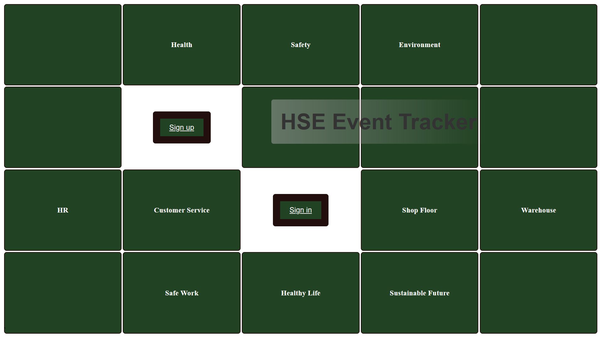
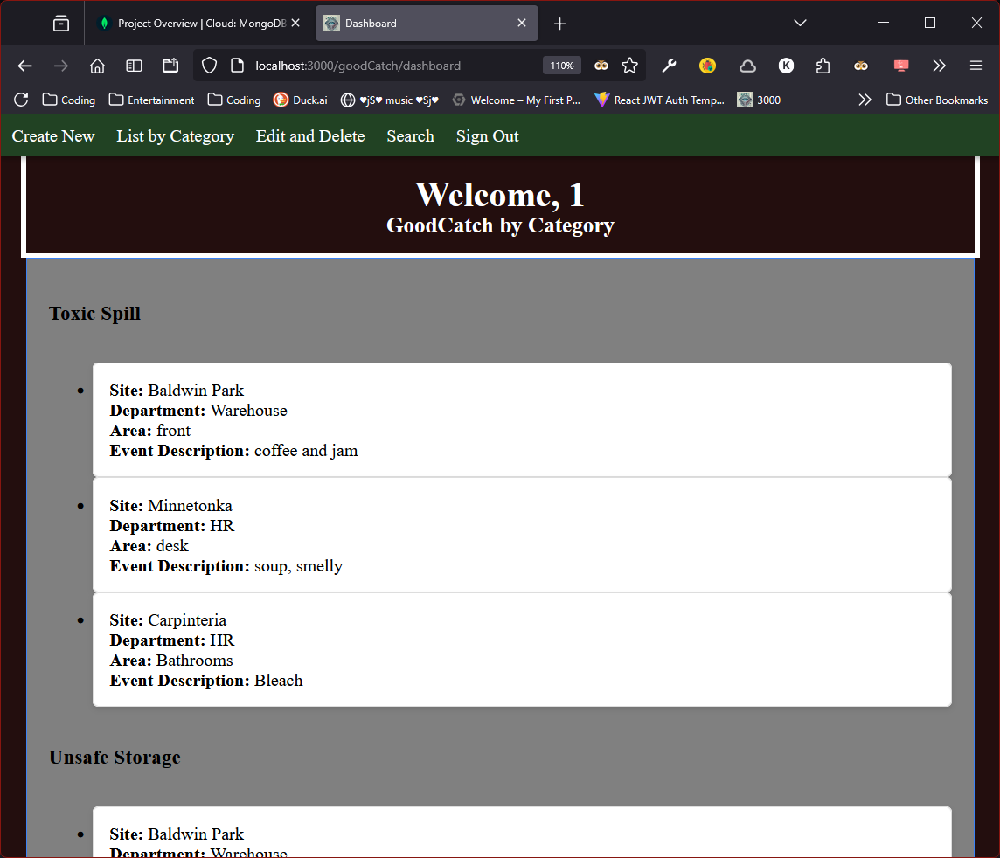
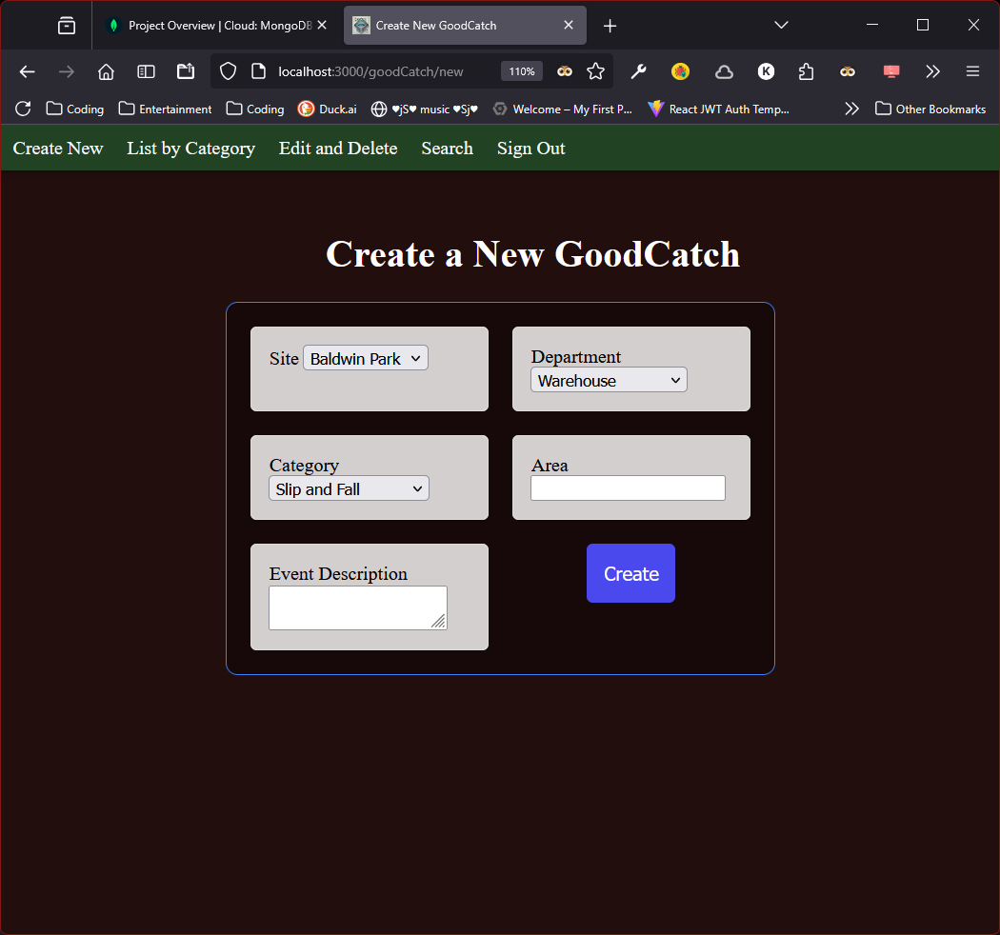

# GoodCatch Event Tracker

**GoodCatch Event Tracker** is a full-stack Node/Express app that empowers employees to document, track, and manage safety-related events in the workplace. 
Users can sign up, log in, and create detailed reports for incidents such as slips, spills, or unsafe storage — helping ensure workplace safety stays top priority.
The reason I  wanted to do this for this project is this was the only request from my users that i was unable to complete during my time there. 

---

## Screenshots
**Landing Page**

**Dashboard**

**Good Catch Create Form**

---
## Links

Planning Materials: [Trello Board](https://trello.com/b/s65fbdIK/hse-good-catch-tracker)
GitHub Repo: [hse-goodcatch-v4](https://github.com/kjwagner613/hse-goodcatch-v4)
Deployed App Link: [Good Catch Tracker](https://hse-goodcatch-tracker-a52f04b138c7.herokuapp.com/)

---

## Features

- ✅ User Authentication (sign up, sign in, session-based auth)
- ✅ Create, Read, Update, Delete (CRUD) for safety events
- ✅ Events grouped by category and user
- ✅ Real-time search by site, department, category, or area
- ✅ Embedded event structure with `category` + `description`
- ✅ Clean, responsive design using CSS Grid & Flexbox
- ✅ Session-based access control (private dashboards)
- ✅ CSRF Protection for secure form submissions

---

## Technologies Used

- ⚙️ Node.js
- ⚙️ Express
- ⚙️ MongoDB + Mongoose
- ⚙️ EJS Templating
- ⚙️ bcrypt for password hashing
- ⚙️ express-session for session management
- ⚙️ csurf for CSRF protection
- ⚙️ dotenv for environment variables
- ⚙️ method-override for PUT/DELETE support

---

## Attributions

-  🎉 CSS Grid Layout: [weschools](https://www.w3schools.com/css/css_grid.asp)
- 🎉 CSS guide: [Mdn Web Docs](https://developer.mozilla.org/en-US/docs/Web/CSS)
- 🎉 CSRF: [CSRF Protection Guide](https://www.stackhawk.com/blog/node-js-csrf-protection-guide-examples-and-how-to-enable-it/)
- 🎉 Routes and Controllers: [Understanding Express Routes, Controllers and Services](https://dev.to/hakimmohamed/understanding-express-routes-controllers-and-services-a-beginners-guide-nodejs-tutorial-part-12-2cd4)
- 🎉 Troubleshooting: AI Gemini, Copilot, ChatGPT

--- 

## Next Steps

- Offer to HSE dept of my last employer as a base and can develop from here
- Align with full HSE Processes
